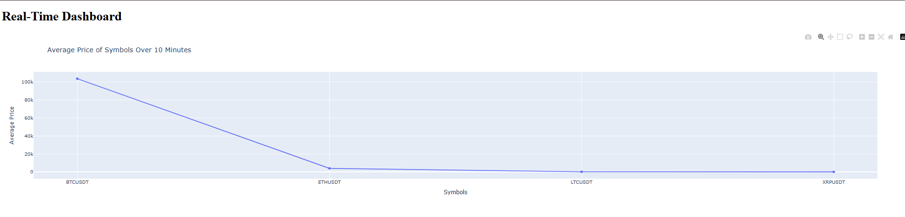

# Kafka Flink Stock Data Streaming Project

## Project Overview

This project uses Binance API to fetch streaming stock data, processes it with Apache Kafka and Apache Flink, and visualizes the processed results using Dash. The primary goal of this project is to ingest stock-related data (such as the latest price, order book data, recent trades, and market statistics) into Kafka, process it in real-time using Flink, and generate a visual dashboard for better understanding of the data trends.

### Project Structure

```plaintext
project_structure = {
    "kafka flink project ": { 
        "src": {
            "main": {
                "java": {
                    "com": {
                        "project": {
                            "flink": ["FlinkJob.java", "StockData.java", "Main.java"]
                        }
                    }
                },
            },
            "python": {
                "api": ["fetch_data.py"],
                "flink": ["flink_job.py"],
                "kafka": ["consumer.py", "producer.py"],
                "visualization": ["dashboard.py"]
            }
        },
        "pom.xml": None,
        "requirements.txt": None,
        "logs": []
    }
}
```

## Features

- **Data Ingestion**: Fetches stock-related data such as:
  - **Order Book Data**: Top 10 bids and asks for all symbols.
  - **Latest Price Data**: Real-time prices of selected symbols.
  - **Recent Trade Data**: Last 10 trades for all symbols.
  - **24-Hour Market Statistics**: Overview of 24-hour market performance for all symbols.

- **Kafka Integration**: Utilizes Kafka as the message broker to ingest and transmit stock data.
  - **Producer**: Sends stock data into Kafka topic `stock-data`.
  - **Consumer**: Consumes stock data from the Kafka topic `stock-data`.

- **Real-Time Data Processing with Apache Flink**:
  - Applies a **sliding window** operation with a **window length of 10 minutes** and a **slide length of 1 minute**.
  - Calculates the average price for the selected symbols over each 10-minute window.
  - Sends the processed data back to Kafka.

- **Visualization with Dash**:
  - Visualizes the **average price per symbol** for each 10-minute window in real-time.

## Prerequisites

Before running the project, ensure the following prerequisites are met:

- **Java**: Version 8 or higher is required for running the Flink job.
- **Python**: Version 3.x is required for running the Python scripts.
- **Apache Kafka**: Running and configured locally.
- **Apache Flink**: Set up and running locally.
  
Additionally, install the required dependencies using the following commands:

### Maven Dependencies for Java (pom.xml)

1. Apache Flink
2. Kafka Client

### Python Dependencies (requirements.txt)

1. kafka-python
2. dash
3. requests

## Installation

### 1. Clone the repository
```bash
git clone <repository-url>
cd kafka-flink-project
```

### 2. Set up Kafka and Flink
Ensure that both Kafka and Flink are running in your local environment.

### 3. Install Python Dependencies
```bash
pip install -r requirements.txt
```

### 4. Build and Run Java Flink Job
To build the project and run the Flink job, follow these steps:

1. Navigate to the project directory.
2. Build the Maven project:
   ```bash
   mvn clean install
   ```
3. Run the Flink job:
   ```bash
   java -jar target/your-flink-job.jar
   ```

### 5. Run Kafka Consumer and Producer (Python)
In a separate terminal, run the producer to send stock data to Kafka:
```bash
python -m src.python.kafka.producer.py
```

Then, run the consumer to process the data using Flink:
```bash
python -m src.python.kafka.consumer.py
```

### 6. Visualize the Data (Dash)
To visualize the processed data, run the following:
```bash
python src/python/visualization/dashboard.py
```

This will open a Dash web application showing the real-time average prices of the symbols. "http://127.0.0.1:8050/"

## Data Flow Overview

1. The **API** fetches stock data (latest price, order book, recent trades, and market stats).
2. The **Producer** sends this data to the **Kafka topic** `stock-data`.
3. The **Consumer** reads from Kafka, processes the data using **Apache Flink** with a 10-minute sliding window and 1-minute slide length, and calculates the average price.
4. The processed data is sent back to the Kafka topic, where it can be consumed for **visualization**.
5. The **Dash** dashboard presents the processed data for easy interpretation.

## Kafka and Flink Configuration

- Kafka Topic: `stock-data`
- Flink Window: Sliding window of 10 minutes with a 1-minute slide length (configurable).


## Contact

For questions or any information, please reach out to [meriam.inoubli@dauphine.tn].

## Visualization Example

Below is an example of the visualization dashboard displaying the average prices per symbol for each 10-minute window.



